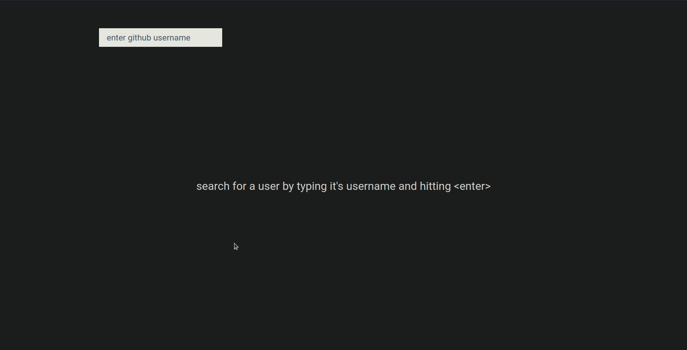

# Github Profile Viewer (WIP)

This project is an implementation of [this app idea](https://github.com/florinpop17/app-ideas/blob/master/Projects/2-Intermediate/GitHub-Profiles.md) from the [app-ideas](https://github.com/florinpop17/app-ideas) repository.

It consists of a page where you can search a github user and see information about him and his top 4 repositories. I made it as a way to study [Chakra UI](https://chakra-ui.com/) (had never used it before) and practice UI design skills.

## ⚡ Demo
You can access it [here](https://github-profile-viewer-diegodvv.netlify.app/)!

  

## 💻 Techs

- [React](https://reactjs.org/) and [Create React App](https://create-react-app.dev/)
- ⭐ [Chakra UI](https://chakra-ui.com/)

## 🚀 Run

- Clone repository `git clone https://github.com/diegodvv/github-profile-viewer.git`
- Install dependencies `yarn install`
- Start server `yarn start`
- Open [http://localhost:3000](http://localhost:3000)

### Todo
- :white_check_mark: Show user profile information and repositories
- :white_large_square: Show alert if user doesn't exist
- :white_large_square: Support light theme
- :white_large_square: Use transitions with framer motion
- :white_large_square: Render emoji on names and descriptions